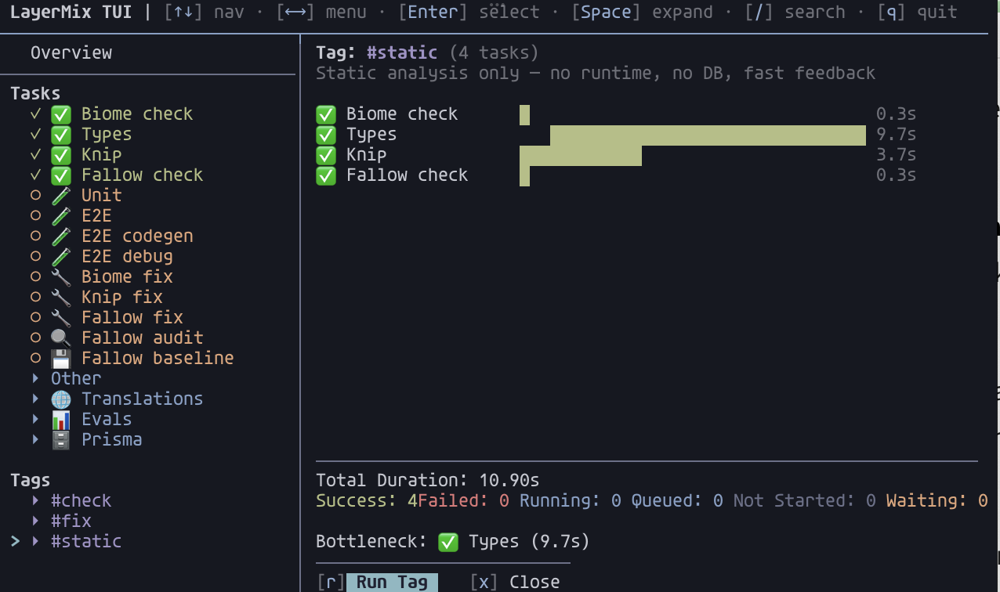

# @layermix/cli

One task runner for humans, CI, and AI agents. You declare tasks and their dependencies in a `task-runner.json`. `layermix` builds the graph and runs tasks in parallel up to the graph's constraints.

- In a terminal: an interactive Ink TUI. Live status, keyboard-driven retry, `/` for search.
- In CI: buffered linear output that's parallel-safe, plus a JUnit report if you want one.
- Inside Claude Code, Cursor, Aider, Continue: auto-detected via env vars, linear output, no flags needed.



Full docs: <https://layermix-labs.github.io/cli/>

```sh
npm i -g @layermix/cli
```

## 60-second tour

```sh
layermix init                         # scaffold task-runner.json
layermix list                         # see what's defined
layermix validate                     # check the DAG is cycle-free

layermix id [id]                      # run tasks (and their deps)
layermix -t test                      # run every task tagged 'test'
layermix --dry-run-json -t test       # print the JSON plan, run nothing
```

Example `task-runner.json`:

```json
{
  "$schema": "https://unpkg.com/@layermix/cli@2.3.0/schema.json",
  "defaultRun": "-t test",
  "tasks": [
    { "id": "clean",   "cmd": "rm -rf dist",   "dependsOn": [] },
    { "id": "compile", "cmd": "tsc",           "dependsOn": ["clean"] },
    { "id": "lint",    "cmd": "biome check .", "dependsOn": [],          "tags": ["test"] },
    { "id": "test",    "cmd": "vitest run",    "dependsOn": ["compile"], "tags": ["test"] }
  ]
}
```

Transitive deps fire automatically. `layermix test` runs `clean`, then `compile`, then `test`. `layermix -t test` runs everything tagged `test`, with max parallelism.

Drop it in CI:

```sh
layermix -t test --ci --junit report.xml
```

## Why I built this

I kept writing the same shell glue in every project: "clean, then `tsc`, then in parallel run lint and test". `make` works for DAGs but fights modern shell escapes. `turborepo` and `nx` are heavier than I want for a small TypeScript project. `npm-run-all` does parallel but not dependencies.

`layermix` is one JSON file and a runner that works the same on my laptop, in CI, and inside a coding agent. A few opinionated choices:

- A bare `layermix` in CI/AI mode it exits 1, so a scheduled agent can't silently succeed. In a terminal it opens the TUI idle.
- Unknown task ids and tags exit 1 in every mode. `layermix tst` (typo for `test`) fails loudly instead of quietly succeeding.
- Linear output is simple on purpose: `[task] Starting...` / `Finished` / `Failed` / `Skipped` headers, logs between them. Grep-friendly.
- The same config drives TUI, linear, and dry-run JSON. There's no separate CI config.

## Documentation

The site at <https://layermix-labs.github.io/cli/> has the details. Each page also lives in this repo:

- [`docs/config.md`](./docs/config.md): `task-runner.json` reference. Every field, monorepo merge semantics, `defaultRun`, tags vs groups.
- [`docs/tui.md`](./docs/tui.md): Terminal UI guide. Layout, keybindings, search, the seven run / retry actions.
- [`docs/ci-and-agents.md`](./docs/ci-and-agents.md): Linear mode. `--ci`, `--ai`, auto-detection, JUnit, dry-run JSON, agent skill file.
- [`docs/task-arguments.md`](./docs/task-arguments.md): Parameterised tasks with `$1`, `$2`. File pickers in the TUI and `--arg` on the CLI.
- [`docs/scenarios.md`](./docs/scenarios.md): "I want to X" playbook.
- [`docs/cli-reference.md`](./docs/cli-reference.md): Every flag and exit code.

If you're using `layermix` from Claude Code or another coding agent, there's also an [`agent-skill.md`](./agent-skill.md) you can drop into your project to teach the agent how to use it correctly.

## Install

```sh
npm i -g @layermix/cli
# or ad-hoc, with npx
npx @layermix/cli init
```

Node 20+. Binary: `layermix`.

## License

[MIT](./LICENSE)
